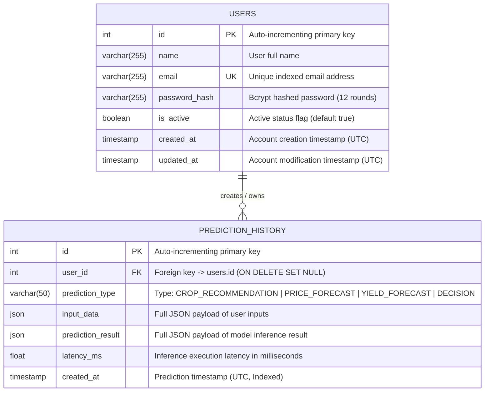

# AgriPulse V1.0: Database Design & Schema Documentation

**Platform**: AgriPulse — Precision Agriculture Platform Using Deep Learning  
**Database**: PostgreSQL 15 / SQLite (Testing Isolation)  
**ORM**: SQLAlchemy 2.0  
**Version**: 1.0 (Production-Ready Academic Release)

---

## 1. Entity-Relationship (ER) Diagram

---

## 2. Table Specifications

### 2.1 Table: `users`
Represents registered users (farmers, agronomists, researchers).

| Column Name | Data Type | Constraints | Description |
| :--- | :--- | :--- | :--- |
| `id` | `INTEGER` | `PRIMARY KEY`, `AUTO_INCREMENT`, `INDEX` | Unique identifier for each user |
| `name` | `VARCHAR(255)` | `NOT NULL` | Full display name of the user |
| `email` | `VARCHAR(255)` | `UNIQUE`, `NOT NULL`, `INDEX` | Normalized login email address |
| `password_hash` | `VARCHAR(255)` | `NOT NULL` | Bcrypt password hash with 12 salt rounds |
| `is_active` | `BOOLEAN` | `NOT NULL`, `DEFAULT TRUE` | Soft-deactivation status flag |
| `created_at` | `TIMESTAMP WITH TIME ZONE` | `NOT NULL`, `DEFAULT UTC_NOW` | Account registration timestamp |
| `updated_at` | `TIMESTAMP WITH TIME ZONE` | `NOT NULL`, `DEFAULT UTC_NOW` | Account details last modified timestamp |

### 2.2 Table: `prediction_history`
Stores an immutable, auditable log of predictions executed across all 4 machine learning pipelines.

| Column Name | Data Type | Constraints | Description |
| :--- | :--- | :--- | :--- |
| `id` | `INTEGER` | `PRIMARY KEY`, `AUTO_INCREMENT`, `INDEX` | Unique identifier for each prediction log |
| `user_id` | `INTEGER` | `FOREIGN KEY (users.id) ON DELETE SET NULL`, `NULLABLE`, `INDEX` | Associated user who triggered inference |
| `prediction_type` | `VARCHAR(50)` | `NOT NULL`, `INDEX` | Category (`CROP_RECOMMENDATION`, `PRICE_FORECAST`, `YIELD_FORECAST`, `DECISION`) |
| `input_data` | `JSON` | `NOT NULL` | Exact input parameters provided by the user |
| `prediction_result` | `JSON` | `NOT NULL` | Comprehensive inference output generated by the models |
| `latency_ms` | `FLOAT` | `NULLABLE` | Total model execution time in milliseconds |
| `created_at` | `TIMESTAMP WITH TIME ZONE` | `NOT NULL`, `DEFAULT UTC_NOW`, `INDEX` | Inference generation timestamp |

---

## 3. Relationships & Data Integrity Constraints

1. **One-to-Many Ownership**:
   - `User` $\to$ `PredictionHistory`: A single registered user can produce many prediction records over time (`1:N`).
   - `cascade="all, delete-orphan"`: In the ORM layer, deleting a user safely manages or cascades associated history records.
2. **Referential Integrity**:
   - `ON DELETE SET NULL`: If a user account is deleted, prediction audit records remain preserved for anonymized historical analysis while `user_id` is set to `NULL`.
3. **Indexes for Query Optimization**:
   - `users.email`: Indexed with unique constraint for $O(1)$ authentication lookups.
   - `prediction_history.user_id`: Indexed for fast retrieval of user-specific history.
   - `prediction_history.prediction_type`: Indexed for high-performance category filtering.
   - `prediction_history.created_at`: Indexed for chronological descending pagination.

---

## 4. Monitoring & Telemetry Data Persistence Strategy

- **In-Memory Telemetry Ring Buffer**: High-frequency API telemetry (min/max/average latencies and request counters) is tracked in-memory by `MetricsCollector` to ensure zero database write overhead during fast inference requests.
- **Statistical Aggregation from `prediction_history`**:
  - The `DistributionService` and `DriftService` query the indexed `prediction_history` table using SQLAlchemy aggregations to compute real-time feature distributions and historical class frequencies without duplicating storage.