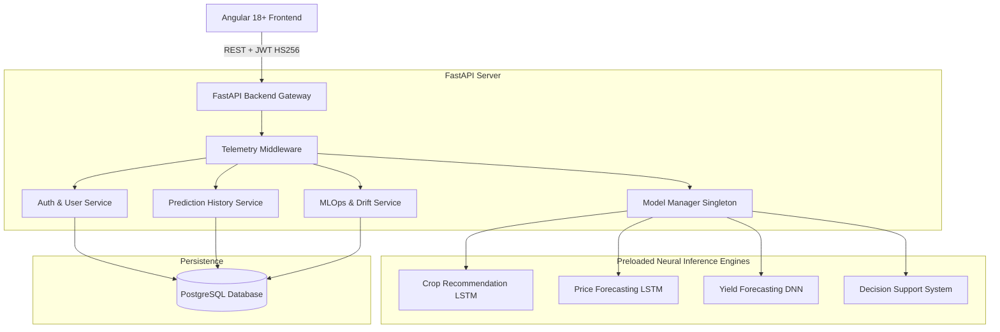

# AgriPulse V1.0: Final Comprehensive System Architecture

**Platform**: AgriPulse — Precision Agriculture Platform Using Deep Learning  
**Working Root**: `D:\FINAL FINAL YEAR PROJECT`  
**Version**: 1.0 (Production-Ready Academic Release)

---

## 1. Project Overview
AgriPulse is an integrated artificial intelligence platform designed to address critical agricultural decision-making challenges by synthesizing soil nutrient dynamics, crop yield productivity, and wholesale commodity market trajectories.

## 2. Problem Statement
Smallholder and commercial farmers face high economic and operational uncertainty caused by:
1. Sub-optimal crop selection due to unscientific soil nutrient assessment.
2. Unpredictable harvest yields caused by regional and seasonal climate variations.
3. Market price volatility and lack of forward-looking commodity price visibility.
4. Isolated tools that fail to synthesize agronomic suitability, yield productivity, and economic returns into an actionable decision.

## 3. Objectives
- Develop deep learning neural networks for soil crop recommendation (Level 3A), commodity price forecasting (Level 3B), and district yield estimation (Level 3C).
- Unify multi-modal models into a composite AI Agricultural Decision Support System (Level 7).
- Implement an enterprise-grade REST backend with JWT authentication and PostgreSQL audit logging (Levels 4 & 5).
- Build a responsive Angular 18+ SPA visualization dashboard (Level 6).
- Establish real-time MLOps telemetry, model registry governance, statistical data drift monitoring, and automated CI/CD (Level 8).

## 4. System Architecture

## 5. Frontend Architecture
- **Framework**: Angular 18+ Standalone Architecture (no NgModules).
- **State Management**: Angular Signals (`signal`, `computed`, `effect`) for fine-grained reactivity.
- **Visualizations**: Chart.js (`ng2-charts`) rendering radar soil charts, time-series price line charts, and multi-factor decision bar charts.
- **Security**: `authInterceptor` for Bearer token injection; `authGuard` for client-side route authorization.

## 6. Backend Architecture
- **Framework**: FastAPI (ASGI) with asynchronous request handlers.
- **Lifespan Initialization**: Models and preprocessors preloaded during startup into singleton memory.
- **Data Validation**: Strict Pydantic v2 schemas for all request payloads and responses.
- **Error Handling**: Global exception interceptors mapping HTTP 400, 401, 403, 404, 422, and 500 status codes with structured error JSON.

## 7. Database Architecture
- **Engine**: PostgreSQL 15 (Relational Engine).
- **ORM**: SQLAlchemy 2.0 with connection pooling (`pool_size=10`, `max_overflow=20`).
- **Entity Schema**:
  - `users`: ID, name, email (unique index), password_hash (Bcrypt), is_active, created_at, updated_at.
  - `prediction_history`: ID, user_id (FK -> users.id), prediction_type, input_data (JSON), prediction_result (JSON), latency_ms (Float), created_at (Indexed timestamp).

## 8. ML Architecture Summary
| Pipeline | Architecture | Input Shape | Primary Metric | Target Task |
| :--- | :--- | :---: | :---: | :--- |
| **Crop AI** | Bidirectional LSTM | $(7, 1)$ | **98.79% Accuracy** | 22-class Softmax Probability |
| **Price AI** | Multi-Step Time-Series LSTM | $(30, 1)$ | **$R^2 = 0.9375$** | Recursive 1, 7, 30-Day Forecast |
| **Yield AI** | Deep Neural Network (DNN) | Categorical + Scaled | **$R^2 = 0.9165$** | Tonnes/Hectare Regression |
| **DSS AI** | Multi-Criteria Optimizer | Integrated 13 Params | Composite Score | Top Recommendation & Ranked Alternatives |

## 9. Crop Recommendation Pipeline
1. Input Features: $N, P, K \in [0, 140]$, Temperature ($^\circ\text{C}$), Humidity ($\%$), pH ($[0, 14]$), Rainfall ($\text{mm}$).
2. Standard Scaling applied using fitted scaler.
3. Bidirectional LSTM network executes forward and backward temporal passes.
4. Softmax output layer yields probabilities across 22 crop classes. Top-5 returned.

## 10. Price Forecasting Pipeline
1. Input Features: Commodity name, Mandi market, historical daily wholesale prices ($N \ge 30$).
2. MinMax scaling ($[0, 1]$) applied to the 30-day lookback sequence.
3. LSTM model generates recursive autoregressive step-by-step predictions.
4. Inverse MinMax transform reconstructs actual ₹/quintal projections and trend direction (`UPWARD`, `DOWNWARD`, `STABLE`).

## 11. Yield Prediction Pipeline
1. Input Features: State (33 states), District (646 districts), Crop, Season, Area (Hectares), Crop Year.
2. OneHotEncoder encodes state, district, crop, and season. StandardScaler scales area and year.
3. Dense Deep Neural Network (DNN) with BatchNorm, Dropout (0.2), and ReLU activations predicts productivity ($t/\text{ha}$).
4. Total estimated production calculated as $\text{Yield} \times \text{Area}$.

## 12. Decision Support Pipeline
1. Calls Crop Recommendation LSTM to identify viable candidate crops.
2. For top candidates, evaluates Yield DNN and Price LSTM across the forecast horizon.
3. Computes normalized multi-factor composite score ($0 \le \text{Score} \le 100$):
   $$\text{Score} = 0.40 \times \text{Suitability} + 0.35 \times \text{Yield} + 0.25 \times \text{Market}$$
4. Ranks candidate alternatives and generates context-aware plain-English dynamic rationale.

## 13. Authentication Architecture
- **Password Security**: Bcrypt with 12 salt rounds (`passlib`).
- **Token Format**: Standard RFC 7519 JSON Web Token (JWT) with HS256 signature.
- **Claims**: `sub` (user email), `id` (user ID), `exp` (UTC expiration).
- **Session Strategy**: Stateless token authentication with client-side localStorage persistence.

## 14. Prediction History
- Asynchronous logging of prediction payloads into PostgreSQL for authenticated users.
- Tenant isolation: users can only view, query, or delete their own logged history.
- Paginated REST endpoint supporting filtering by `prediction_type`.

## 15. MLOps Architecture
- Centralized `MetricsCollector` capturing continuous application telemetry.
- Production model registry cataloging versions, architectures, and target metrics.
- Prometheus-ready metrics formatting.

## 16. Monitoring Subsystem
- **Health Probes**: Liveness (`/api/v1/health`) and Readiness (`/api/v1/monitoring/health`) checks validating database connection latency and model preloading.
- **Latency Profiling**: Rolling min, max, and average latency calculations per endpoint.

## 17. Data Drift Subsystem
- Continuously calculates Z-score feature divergence against the ICAR training dataset.
- Classifies drift: Healthy ($Z < 0.5$), Moderate ($0.5 \le Z < 1.0$), Drift Detected ($Z \ge 1.0$).
- Enforces strict minimum threshold ($N \ge 5$) before emitting statistical assessments.

## 18. Deployment Architecture
- Dual deployment model: Local virtual environment or multi-container Docker deployment.
- Production multi-worker ASGI setup with connection pooling and reverse proxy.

## 19. Docker Architecture
- **Backend Container**: Python 3.10-slim base with non-root security user and pre-downloaded wheel dependencies.
- **Frontend Container**: Multi-stage build (Node.js 20 build stage -> Nginx Alpine production runtime).
- **Database Container**: PostgreSQL 15 Alpine with persistent named volumes and automated health checks.
- **Compose**: Orchestrated via `docker/docker-compose.yml`.

## 20. CI/CD Architecture
- **GitHub Actions**: `.github/workflows/ci.yml` executing on every push and pull request.
- **Pipeline Stages**:
  1. Backend unit and integration test suite with PostgreSQL service container.
  2. Frontend Angular unit tests (Vitest) and AOT production build.
  3. Docker build verification for backend and frontend images.

## 21. Security Architecture
- Parameterized SQL execution preventing SQL injection.
- Pydantic schema validation preventing malformed input injection.
- Zero server path exposure across all REST responses.
- HTTP security headers, CORS origin restriction, and Bearer token verification on all protected endpoints.