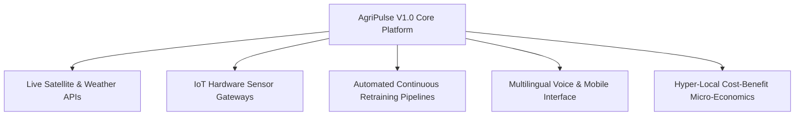

# AgriPulse V1.0: Technical Limitations & Future Scope

**Platform**: AgriPulse — Precision Agriculture Platform Using Deep Learning  
**Working Root**: `D:\FINAL FINAL YEAR PROJECT`  
**Evaluation Standard**: Transparent Engineering Analysis  
**Version**: 1.0 (Production-Ready Academic Release)

---

## 1. Genuine System Limitations

### 1.1 Dataset Boundary & Regional Granularity
- **Historical Scope**: Neural models are trained on historical agricultural records from ICAR, AGMARKNET, and the Directorate of Economics and Statistics (DES).
- **Macro vs Micro-Climate**: While the system supports 646 districts across 33 states, hyper-local micro-climatic variations within a single village or plot cannot be captured without localized ground sensors.

### 1.2 Price Forecasting Sequence Requirement
- **Lookback Constraint**: The Time-Series LSTM price forecasting model requires a minimum of 30 consecutive historical daily price records to generate valid recursive forecasts. If market records for rare commodities are sparse, forecasting capability is limited.

### 1.3 Decision Score Non-Financial Nature
- **Relative Indexing**: The composite Decision Score ($0\text{--}100$) represents a multi-criteria agronomic-economic ranking index. It is not an absolute rupee-denominated profit guarantee, as farm-gate production costs (labor, fertilizer subsidies, transport logistics) vary widely by locality.

### 1.4 Data Drift Sample Threshold
- **Threshold Policy**: Statistical feature drift detection strictly requires at least 5 live inference observations before reporting drift assessments to prevent noise amplification in small sample regimes.

### 1.5 Software-Only Architecture
- **No Physical Hardware**: AgriPulse is intentionally built as an enterprise software platform. It currently relies on user-provided or API-fetched soil parameters rather than real-time in-situ IoT telemetry probes.

---

## 2. Realistic Future Scope & Roadmap

### 2.1 Real-Time Satellite Remote Sensing & Weather Integration
- Integrate Sentinel-2 / Landsat-8 satellite multispectral imagery to calculate real-time **NDVI** (Normalized Difference Vegetation Index) and soil moisture indices.
- Connect live weather forecast APIs (e.g. IMD / OpenWeatherMap) to replace manual temperature and rainfall inputs.

### 2.2 In-Situ IoT Soil Sensor Telemetry
- Interface with low-cost LoRaWAN or ESP32 soil sensor probes measuring real-time soil N-P-K, electrical conductivity (EC), moisture, and temperature.
- Ingest live telemetry directly via MQTT or WebSocket streams into the FastAPI backend.

### 2.3 Automated Continuous Model Retraining (CI/CD/CT)
- Implement automated MLOps continuous training pipelines using Apache Airflow or Kubeflow that trigger retrain jobs whenever `DriftService` reports $Z \ge 1.0$ or new monthly AGMARKNET mandi records are published.

### 2.4 Multilingual Mobile Application with Voice Interaction
- Develop a cross-platform mobile client (Flutter / React Native) with native support for Indian regional languages (Hindi, Punjabi, Marathi, Bengali, Telugu, Tamil).
- Integrate speech-to-text models (e.g., Whisper / Bhashini) for hands-free farmer voice queries.

### 2.5 Farm-Gate Micro-Economic Cost Modeling
- Extend the Decision Support Engine to accept localized input cost estimates (fertilizer prices, irrigation electricity tariffs, labor wages) to calculate net margin estimates alongside the Decision Score.