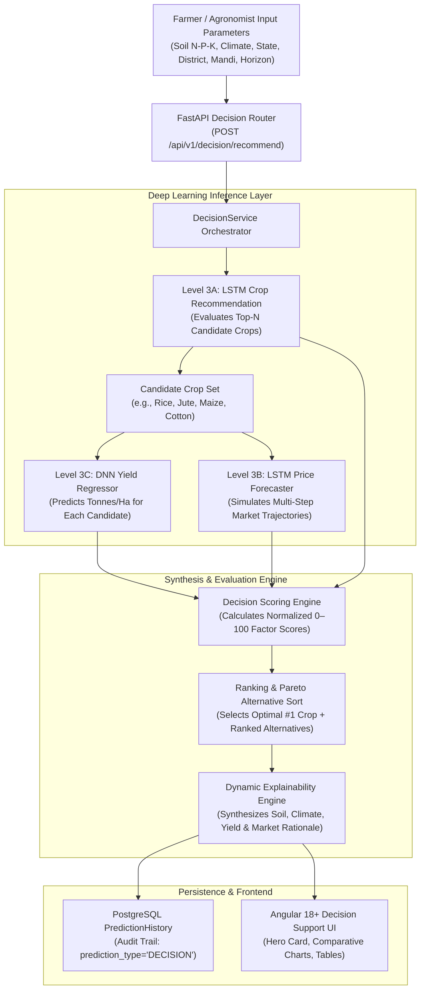

# Level 7: AI Agricultural Decision Support System — Architecture Document

**Project**: AgriPulse — Precision Agriculture Platform Using Deep Learning  
**Working Root**: `D:\FINAL FINAL YEAR PROJECT`  
**Status**: **LEVEL 7 COMPLETE**  
**Version**: 1.0.0 (Production Release)

---

## 1. System Overview & Objective

AgriPulse Level 7 establishes an integrated, multi-modal **Agricultural Decision Support System (DSS)**. Rather than requiring agronomists and farmers to manually run three siloed ML models (Crop Recommendation, Market Price Forecasting, and Yield Forecasting) and mentally correlate the outputs, Level 7 orchestrates the three models into a unified inference pipeline.

The DSS synthesizes:
1. **Biological & Soil Suitability** (Deep Learning LSTM — Level 3A)
2. **Harvest Production Yield** (Deep Neural Network Regressor — Level 3C)
3. **Mandi Commercial Price Trajectory** (Time-Series LSTM — Level 3B)

$$\text{Decision Score} = 0.40 \times \text{Suitability Score} + 0.35 \times \text{Yield Score} + 0.25 \times \text{Market Score}$$

---

## 2. Multi-Objective Pipeline & Data Flow

---

## 3. Mathematical Decision Scoring Formulation

To maintain scientific integrity without claiming guaranteed monetary profit, AgriPulse computes a normalized **Decision Score** ($D_i \in [0, 100]$):

### 3.1 Suitability Score ($I_{\text{suit}}$)
$$I_{\text{suit}} = S_i \times 100$$
Where $S_i \in [0, 1]$ is the softmax probability output by the LSTM Crop Recommendation classifier for crop $i$.

### 3.2 Harvest Yield Score ($I_{\text{yield}}$)
$$I_{\text{yield}} = \min\left(100, \max\left(5, \frac{Y_i}{5.0} \times 100\right)\right)$$
Where $Y_i$ is the predicted productivity in Tonnes per Hectare from the DNN regressor, benchmarked against a typical standard peak agricultural yield baseline ($5.0\text{ t/ha}$).

### 3.3 Market Score ($I_{\text{market}}$)
$$I_{\text{market}} = \min\left(100, \max\left(10, \frac{M_i}{4500} \times 60 + \text{trend\_bonus}\right)\right)$$
Where $M_i$ is the predicted wholesale modal price (₹/quintal) from the LSTM time-series model, normalized against ₹4,500/quintal baseline, with a direction modifier:
- `UPWARD`: $+15$ pts
- `STABLE`: $+5$ pts
- `DOWNWARD`: $-5$ pts

### 3.4 Composite Decision Score ($D_i$)
$$D_i = 0.40 \times I_{\text{suit}} + 0.35 \times I_{\text{yield}} + 0.25 \times I_{\text{market}}$$

The candidate crop maximizing $D_i$ is selected as the **Recommended Crop** (Rank #1), while the remaining candidates populate the **Alternatives Evaluation Matrix**.

---

## 4. Component Structure

| Component | File Path | Role |
| :--- | :--- | :--- |
| **Backend Schema** | `backend/app/schemas/decision.py` | Pydantic v2 validation contracts for requests and responses |
| **Orchestration Service** | `backend/app/services/decision_service.py` | Asynchronous multi-model execution, scoring, and rationale generation |
| **ML Facade** | `backend/app/services/ml_service.py` | Unified ML facade entry point |
| **API Endpoint** | `backend/app/routes/decision.py` | REST endpoint mounted at `/api/v1/decision/recommend` |
| **Frontend Model** | `frontend/src/app/core/models/decision.model.ts` | TypeScript type definitions |
| **Frontend Service** | `frontend/src/app/core/services/decision.service.ts` | Angular HTTP Client service |
| **Frontend UI Component** | `frontend/src/app/features/decision-support/*` | Standalone UI with Signals, Chart.js comparative charts, and rationale |

---

## 5. Verification & Testing

- **Backend Pytest Regression**: 81/81 tests passing (100% green)
- **Frontend Unit Tests**: 29/29 tests passing across 11 suites (100% green)
- **Production Build**: Angular 18+ build 0 errors, optimized lazy chunking (`decision-support-component` 31.10 kB)
