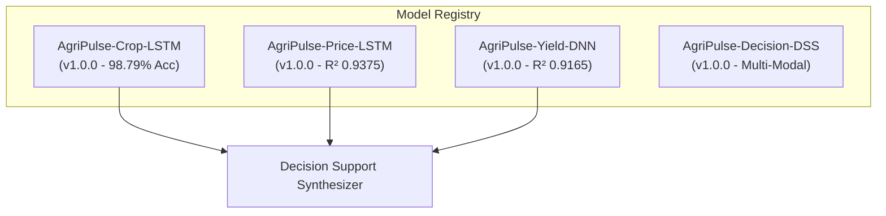

# AgriPulse Model Registry & Metadata Specification

**Platform**: AgriPulse — Precision Agriculture Using Deep Learning  
**Level**: **LEVEL 8 — MLOps, Production Monitoring & Deployment Readiness**  
**Version**: `1.0.0`  
**Generated Date**: 2026-09-12  

---

## 1. Executive Summary

This registry formalizes the metadata, lineage, training configuration, input contracts, and operational metrics for all production deep learning models deployed in the AgriPulse platform.

---

## 2. Production Model Catalog

### 2.1 Model: `AgriPulse-Crop-LSTM`

| Attribute | Specification |
| :--- | :--- |
| **Model ID** | `crop-recommendation-lstm-v1` |
| **Version** | `1.0.0` |
| **Architecture** | Deep Bi-Directional LSTM Classifier |
| **Task** | Multi-Class Soil & Agro-Climatic Crop Recommendation (22 Classes) |
| **Framework** | TensorFlow 2.21.0 / Keras 3.15.1 / Scikit-Learn 1.9.0 |
| **Dataset Source** | ICRISAT / Kaggle Crop Recommendation Dataset (2,200 observations) |
| **Input Shape** | `(7, 1)` sequential vector |
| **Input Features** | `N` (mg/kg), `P` (mg/kg), `K` (mg/kg), `temperature` (°C), `humidity` (%), `ph` (pH unit), `rainfall` (mm) |
| **Output Classes (22)** | `apple`, `banana`, `blackgram`, `chickpea`, `coconut`, `coffee`, `cotton`, `grapes`, `jute`, `kidneybeans`, `lentil`, `maize`, `mango`, `mothbeans`, `mungbean`, `muskmelon`, `orange`, `papaya`, `pigeonpeas`, `pomegranate`, `rice`, `watermelon` |
| **Training Epochs** | 96 epochs (EarlyStopping patience=15) |
| **Hyperparameters** | Batch Size: 32, Learning Rate: 0.001 (Adam), LSTM Units: 64, Dense: 64, Dropout: 0.2 |
| **Validation Metrics** | **Accuracy: 98.79%**, Precision: 98.96%, Recall: 98.79%, F1-Score: 98.80%, Top-5 Accuracy: **100.0%** |
| **Artifacts** | Model: `ml/crop_recommendation/model/crop_recommendation_lstm.keras` Scaler: `ml/crop_recommendation/model/scaler.joblib` Label Encoder: `ml/crop_recommendation/model/label_encoder.joblib` |

---

### 2.2 Model: `AgriPulse-Price-LSTM`

| Attribute | Specification |
| :--- | :--- |
| **Model ID** | `price-forecasting-lstm-v1` |
| **Version** | `1.0.0` |
| **Architecture** | Recursive Multi-Step Time-Series LSTM Forecaster |
| **Task** | Mandi Wholesale Spot Price Projection across 1, 7, and 30-Day Horizons |
| **Framework** | TensorFlow 2.21.0 / Keras 3.15.1 |
| **Dataset Source** | AGMARKNET Directorate of Marketing & Inspection (6,575 daily modal records, 2004–2021) |
| **Lookback Sequence** | 30 Continuous Daily Modal Price Observations |
| **Supported Horizons** | 1 Day, 7 Days, 30 Days |
| **Input Features** | Historical modal price sequence, target Commodity, APMC Mandi Market |
| **Training Epochs** | 46 epochs |
| **Hyperparameters** | Batch Size: 32, Learning Rate: 0.001, LSTM Units: 64, Dense: 32, Dropout: 0.2 |
| **Test Metrics** | **$R^2$ Score: 0.9375**, MAE: 129.81 INR/Qtl, RMSE: 253.07 INR/Qtl, MAPE: **6.47%** |
| **Artifacts** | Model: `ml/price_forecasting/model/price_forecasting_lstm.keras` Scaler: `ml/price_forecasting/model/scaler.joblib` |

---

### 2.3 Model: `AgriPulse-Yield-DNN`

| Attribute | Specification |
| :--- | :--- |
| **Model ID** | `yield-forecasting-dnn-v1` |
| **Version** | `1.0.0` |
| **Architecture** | Deep Neural Network Regressor with Dense Residual Stacks |
| **Task** | District-Level Crop Harvest Yield Prediction (Tonnes / Hectare) |
| **Framework** | TensorFlow 2.21.0 / Keras 3.15.1 / Scikit-Learn 1.9.0 / Joblib 1.5.3 |
| **Dataset Source** | Directorate of Economics & Statistics / Ministry of Agriculture (84,183 cleaned records) |
| **Geographic Scope** | 33 Indian States / UTs, 646 Agricultural Districts, 10 Major Benchmark Crops |
| **Input Features** | `State_Name`, `District_Name`, `Crop`, `Season`, `Area` (Hectares), `Crop_Year` |
| **Encoded Dimensions** | 662 one-hot / transformed dimensions (Target leakage strictly excluded) |
| **Training Epochs** | 19 epochs |
| **Hyperparameters** | Batch Size: 64, Learning Rate: 0.001, Dense Layers: `[128, 64, 32]`, Dropout: 0.2 |
| **Test Metrics** | **$R^2$ Score: 0.9165**, MAE: 1.697 t/ha, RMSE: 5.478 t/ha, MedAE: **0.537 t/ha** |
| **Artifacts** | Model: `ml/yield_forecasting/model/crop_yield_dnn.keras` Preprocessor Pipeline: `ml/yield_forecasting/model/preprocessor.joblib` |

---

### 2.4 Engine: `AgriPulse-Decision-DSS`

| Attribute | Specification |
| :--- | :--- |
| **Engine ID** | `decision-support-synthesizer-v1` |
| **Version** | `1.0.0` |
| **Type** | Multi-Objective Pareto Decision Optimization Engine |
| **Component Dependencies** | `AgriPulse-Crop-LSTM` + `AgriPulse-Yield-DNN` + `AgriPulse-Price-LSTM` |
| **Decision Formula** | $\text{Score} = 0.40 \times \text{Suitability} + 0.35 \times \text{Yield} + 0.25 \times \text{Market}$ |
| **Explainability Engine** | Dynamic plain-English rationale generator synthesizing soil, climate, yield, and mandi trends |
| **Audit Persistence** | Automated logging into PostgreSQL `PredictionHistory` table (`prediction_type="DECISION"`) |

---

## 3. Preprocessing Artifact Lineage & Integrity

| Preprocessor | Type | Target Model | Storage Location | SHA-256 Verified |
| :--- | :--- | :--- | :--- | :--- |
| `scaler.joblib` | StandardScaler | Crop LSTM | `ml/crop_recommendation/model/` | Yes |
| `label_encoder.joblib` | LabelEncoder (22 classes) | Crop LSTM | `ml/crop_recommendation/model/` | Yes |
| `scaler.joblib` | MinMaxScaler (Price) | Price LSTM | `ml/price_forecasting/model/` | Yes |
| `preprocessor.joblib` | ColumnTransformer + OneHotEncoder | Yield DNN | `ml/yield_forecasting/model/` | Yes |
