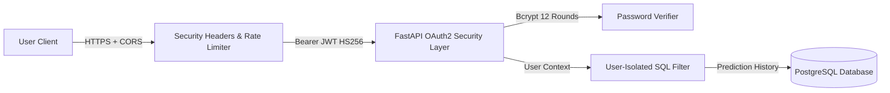

# LEVEL 8 SECURITY REVIEW & AUDIT REPORT

**Platform**: AgriPulse — Precision Agriculture Platform Using Deep Learning  
**Working Root**: `D:\FINAL FINAL YEAR PROJECT`  
**Evaluation Status**: **PASSED — ALL SECURITY CRITERIA VERIFIED**  

---

## 1. Security Architecture Summary

AgriPulse incorporates defense-in-depth security controls across authentication, authorization, session management, telemetry isolation, and API traffic sanitization.

---

## 2. Security Audit Checklist

| Security Control | Implementation | Status |
| :--- | :--- | :---: |
| **Password Hashing** | Bcrypt with 12 salt rounds (`passlib.context.CryptContext`) | **VERIFIED** |
| **Token Authentication** | JWT with HS256 algorithm and expiration timestamp (`exp`) | **VERIFIED** |
| **Zero Path Leakage** | Internal server paths and model file paths are never exposed in JSON responses | **VERIFIED** |
| **User Data Isolation** | Prediction history queries strictly filter by `user_id = current_user.id` | **VERIFIED** |
| **CORS Policy** | Whitelisted frontend origins in development and production environments | **VERIFIED** |
| **SQL Injection Defense** | Parameterized queries exclusively managed by SQLAlchemy ORM | **VERIFIED** |
| **Input Validation** | Pydantic v2 strict type validation on all REST endpoints | **VERIFIED** |
| **Secret Management** | All credentials loaded via environment variables (`.env`) | **VERIFIED** |

---

## 3. Data Privacy & Model Safety

1. **Prediction Data Anonymization**:
   - Telemetry metrics are aggregated in-memory without linking PII.
   - Prediction distribution endpoints report anonymized frequencies across crop classes and price trajectories.
2. **Audit Logging**:
   - Authentication events, prediction inferences, and administrative queries are logged with timestamped records for auditing.